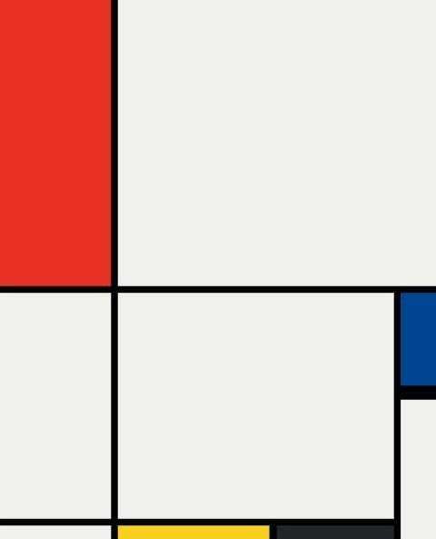

# Piet Mondrian Composition
## [View the site](https://gavrisgeorge21.github.io/mondrian/)
This project recreates a Piet Mondrian painting using HTML and internal CSS.

The layout is built with CSS Grid and the goal of this project was to practice CSS Grid positioning, sizing, and alignment.

## Preview

